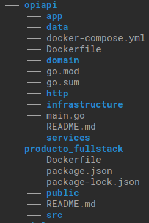

# opiapi

This repository contains the opi api written in golang

### Requirements
- docker

### installation
```bash
$ git clone git@github.com:Javlopez/opiapi.git
```
To be able to use docker compose you should be clone the *producto_fullstack* repository as well 
above the current one
```bash
cd ..        
git@github.com:Javlopez/producto_fullstack.git
```  

Directory structure

        


Run docker-compose
```bash  
cd opiapi
docker-compose up -d
``` 
**Remember to have free the following ports**
- 3000 (front)
- 8005 (api)
- 5432 (postgres)

### To run the seed of data you need to access to docker container and run this command the csv file needs to be a valid csv file
*Caution: this commands run the migrations automatically and therefore the database schema will be created and/or updated, if the databases already exists and contains data with the same information the command will throw an error due violation of unique constraint*
```bash 
$ docker exec -it opiapi_api_1  bash 
bash-5.1#./opiapi --file=data/puntos_examen_fullstack.csv
The file data/puntos_examen_fullstack.csv was procesed successful
bash-5.1#
```
